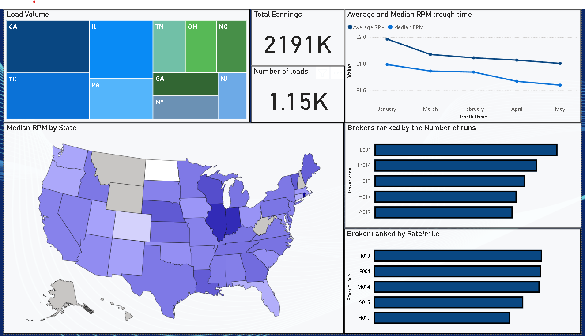

# 🚚 Dispatching agency service optimization - U.S. Trucking Market

### 📊 A Business Intelligence Project Using Real Dispatching Data to Analyze Brokers, Lanes, and Profitability

---

## 🧭 Overview

The trucking industry in the U.S. is currently navigating a complex and volatile environment. Post-COVID economic shifts, rising fuel prices, and market oversaturation have led to declining freight rates. Despite the number of new carriers entering the market, load volumes are shrinking—putting pressure on both trucking companies and dispatchers.

This project aims to **identify the highest-paying brokers and most profitable lanes** by analyzing real dispatching data. By leveraging Power BI and recent performance metrics, this dashboard helps optimize decision-making for dispatchers, maximize revenue per mile, and improve overall operational efficiency.

---

## 🎯 Objectives

- Analyze real operational data to gain visibility into dispatchers performance.
- Identify the most profitable states and freight lanes by RPM (Rate Per Mile).
- Highlight RPM trends and patterns.
- Provide actionable KPIs to support better business decisions in dispatching.

---

## 🗂️ Dataset Description

- **Source**: Internal dispatching data from my agency (2025 YTD).
- **Coverage**: Data from 10 dispatchers managing 50 trucks.
- **Fields include**:  
  - Load date  
  - Broker name  
  - Pickup and delivery locations  
  - Distance (miles)  
  - Total rate  
  - Rate per mile (calculated)  
  - Load volume metrics  

> **Note:** All company names were anonymized using a unique alphanumeric code for confidentiality.

---

## 🧹 Data Cleaning & Preparation

Performed in **Power Query (Excel)** before importing to Power BI:

- Merged dispatcher logs using `UNION` (consistent schema).
- Removed nulls and cleaned blank spaces and typos.
- Split pickup location column to isolate the **origin state**.
- Removed irrelevant columns for performance and clarity.
- Standardized broker names (resolved abbreviations and inconsistencies).
- Created anonymized broker codes using formula:
	=CHAR(64 + INT((ROW([@Name])-2)/20) + 1) & TEXT(MOD(ROW([@Name])-2,20)+1,"000")
- Merged clean broker name with broker code using `XLOOKUP`.

---

## 💻 Tools Used

- **Power BI** – Data modeling, DAX measures, visualization
- **Power Query (Excel)** – Data cleaning and transformation
- **DAX** – Custom measures (e.g., Rate Per Mile, filters, aggregates)

---

## 📈 Key Metrics & KPIs

- Total Loads Moved
- Total Earnings
- Average & Median Rate Per Mile
- RPM by State (Gradient Map)
- Load Volume by Origin State
- Top 5 Brokers (by Load Volume)
- Top 5 Brokers (by RPM)

---

## 📊 Dashboard Features

> 📸 *Insert screenshots of key visuals here*

- ✅ **Cards**: Total Loads & Total Earnings
- 🗺️ **Tree Map**: Load Volume by Origin State
- 📈 **Line Chart**: Average vs. Median Rate Per Mile by Month
- 📊 **Bar Charts**:
- Top 5 Brokers by Load Volume
- Top 5 Brokers by Highest RPM
- 🗺️ **Shape Map**: RPM Distribution by State
---

## 📊 Power BI Dashboard Overview

## 📈 Business Insights

This analysis provides valuable insights into current trucking trends in a challenging post-COVID economic climate. Based on real-world dispatching data for 50 trucks over several months, we uncovered the following:

- **Optimal Lanes**: The most profitable regions, based on a combination of load volume and rate per mile (RPM), include **Illinois (IL), California (CA), Texas (TX), and Pennsylvania (PA)**. Among these, **Illinois (IL)** stands out as the most lucrative due to its consistently high RPM.
  
- **Rate Distribution**: The **average rate per mile is higher than the median**, indicating the presence of **outliers** (extremely high-paying loads) skewing the average upward.

- **Broker Insights**: To address this skew and find more reliable, consistent opportunities, we analyzed:
  - The **top brokers by number of loads hauled**, and
  - The **top brokers by highest RPM paid**
  
  This helps identify partners who offer **both high volume and high pay**, essential for optimizing dispatcher performance and profitability.

These insights allow us to adjust our dispatching strategy, improve route planning, and prioritize broker relationships that maximize both earnings and efficiency.

---

## 🧠 Value to Business

- Helps dispatchers **prioritize high-RPM lanes** and **avoid low-profit areas**.
- Enables **data-driven broker selection** based on historical payout trends.
- Provides management with insights to **adjust lane strategies** and **negotiate rates more effectively**.

---

## 👨‍💼 About Me

I’m a co-founder of a dispatch services agency focused on U.S. trucking logistics. With a background in engineering management and hands-on operations experience, I use data analytics to improve business decisions and optimize fleet performance.

📧 [mladen12189@gmail.com]  
🔗 [https://www.linkedin.com/in/mladen-pe%C5%A1i%C4%87-996723273/]
